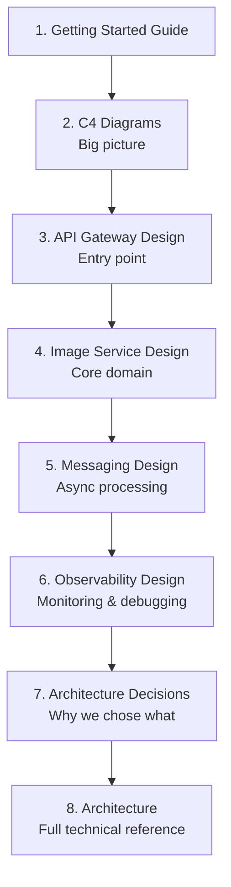

# Voyager Documentation

Welcome to the Voyager documentation! This is a cloud-native image sharing platform with random facts, built with Go, gRPC, Protobuf, NSQ, Kubernetes, and a full observability stack.

---

## 📚 Documentation Map

### Getting Started

| Document | Description | Best For |
|----------|-------------|----------|
| [Getting Started Guide](getting-started.md) | Install Go, understand the project, make your first change | Go beginners coming from Python/JS |

### Architecture & Design

| Document | Description | Best For |
|----------|-------------|----------|
| [C4 Architecture Diagrams](c4-diagrams.md) | Four levels of architecture diagrams (Context → Code) | Visual overview of the entire system |
| [Architecture](architecture.md) | System design, data flows, schemas, observability | Technical deep dive |

### Service Design (Explained Simply)

| Document | Description | Best For |
|----------|-------------|----------|
| [API Gateway Design](design-gateway.md) | HTTP→gRPC translation, auth, rate limiting explained with analogies | Understanding the entry point |
| [Image Service Design](design-image-service.md) | Upload flow, gRPC, Protobuf, PostgreSQL, MinIO explained simply | Understanding the core service |
| [Messaging & Async Processing](design-messaging.md) | NSQ, topics/channels, producer/consumer, retry logic | Understanding async architecture |
| [Observability Design](design-observability.md) | Prometheus, Grafana, Tempo, OpenTelemetry, debugging | Understanding monitoring/tracing |

### Decision Records

| Document | Description | Best For |
|----------|-------------|----------|
| [Architecture Decisions (ADRs)](decisions.md) | Why Go? Why gRPC? Why NSQ? All 10 technology choices explained | Understanding trade-offs |

---

## 🚀 Quick Start

```bash
# 1. Start infrastructure (PostgreSQL, NSQ, MinIO, Prometheus, Grafana, Tempo)
docker compose up -d

# 2. Generate protobuf code
make proto

# 3. Run the API Gateway
go run cmd/api-gateway/main.go

# 4. Verify it works
curl http://localhost:8080/health
# {"status":"ok","service":"api-gateway","version":"0.1.0"}
```

---

## 🌐 Service Ports

| Service | Protocol | Port | Local URL |
|---------|----------|------|-----------|
| API Gateway (REST) | HTTP | 8080 | http://localhost:8080 |
| API Gateway (gRPC) | gRPC | 9090 | localhost:9090 |
| Image Service | gRPC | 50051 | localhost:50051 |
| Facts Service | gRPC | 50052 | localhost:50052 |
| PostgreSQL | TCP | 5432 | localhost:5432 |
| MinIO S3 | HTTP | 9000 | http://localhost:9000 |
| MinIO Console | HTTP | 9001 | http://localhost:9001 |
| NSQ TCP | TCP | 4150 | localhost:4150 |
| NSQ Admin | HTTP | 4171 | http://localhost:4171 |
| Prometheus | HTTP | 9091 | http://localhost:9091 |
| Grafana | HTTP | 3000 | http://localhost:3000 |
| Tempo (OTLP) | gRPC | 4317 | localhost:4317 |

---

## 📖 Reading Order

If you're new to the project, read in this order:



---

## 🛠️ Make Targets

```bash
make proto          # Generate Go code from .proto files
make build          # Build all service binaries
make test           # Run unit tests
make test-int       # Run integration tests
make lint           # golangci-lint
make docker-build   # Build Docker images
make deploy-local   # Deploy to local k3s
make deploy-obs     # Deploy observability stack
make run-all        # Run all services locally
make seed           # Seed database with sample data
make clean          # Remove build artifacts
```
