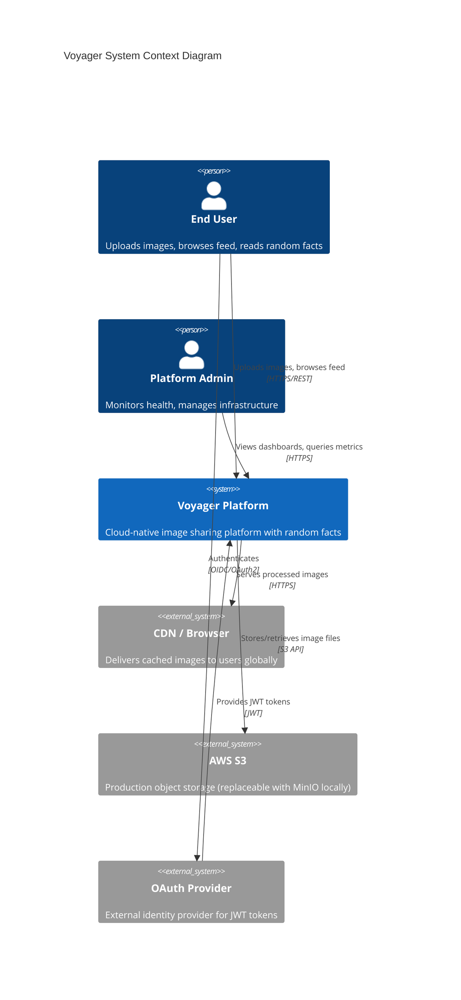
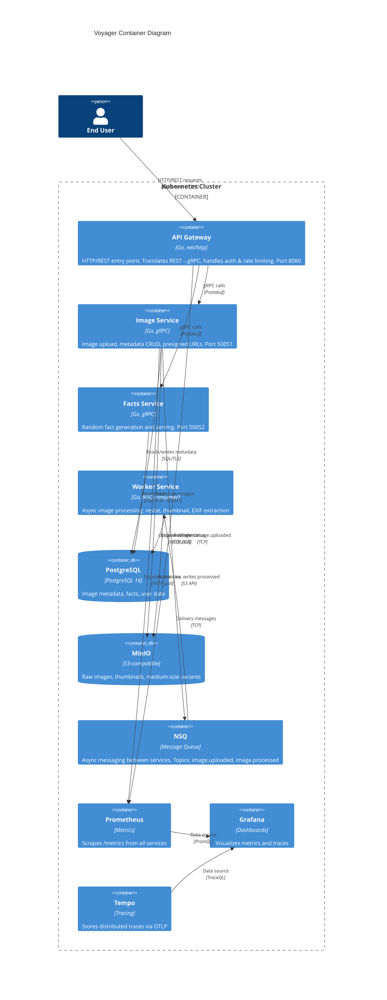
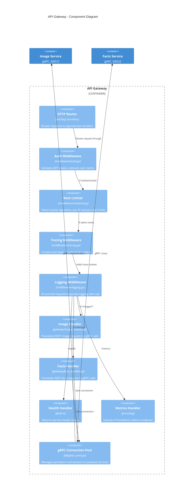
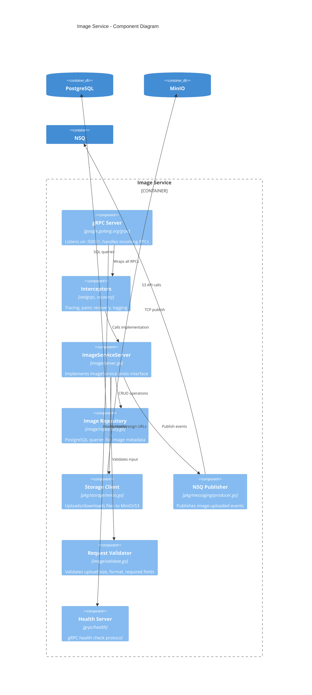
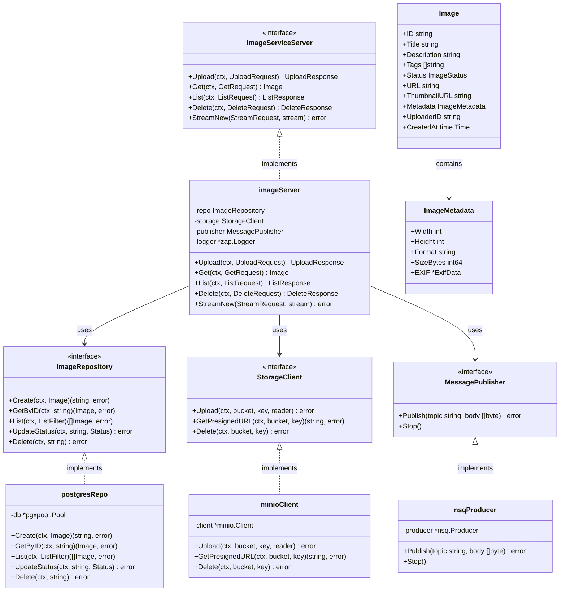
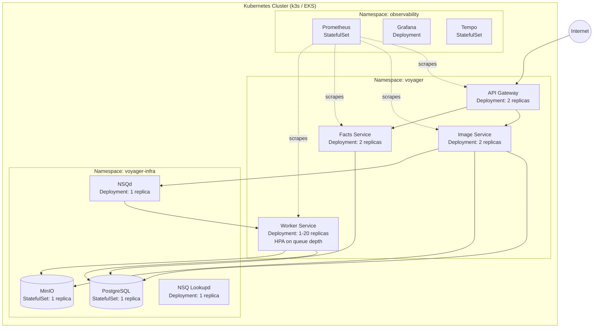

# C4 Architecture Diagrams

This document provides a complete C4 model of the Voyager platform using Mermaid diagrams. The C4 model describes software architecture at four zoom levels, from the 10,000-foot view down to individual code structures.

---

## Level 1: System Context

The highest level. Who uses Voyager, and what external systems does it talk to?

**What this shows**: Voyager is a single system from the outside. Users interact over HTTP. Admins use Grafana dashboards. Image files live in S3-compatible storage.

---

## Level 2: Container Diagram

Zoom in. What containers (services, databases, queues) make up Voyager?

**Key insight**: The API Gateway is the only service exposed externally. All internal communication uses gRPC (synchronous) or NSQ (asynchronous). Each service has a single responsibility.

---

## Level 3: Component Diagram API Gateway

What's inside the API Gateway?

---

## Level 3: Component Diagram Image Service

What's inside the Image Service?

---

## Level 4: Code Diagram Image Service Key Structures

The lowest level. What are the key interfaces, structs, and their relationships?

---

## Deployment Diagram

How does Voyager map to infrastructure?

---

## How to Read These Diagrams

| Level | Question It Answers | Audience |
|-------|-------------------|----------|
| 1 - Context | What does Voyager do? Who uses it? | Everyone |
| 2 - Container | What services/databases exist? How do they connect? | Developers, Architects |
| 3 - Component | What's inside each service? What packages? | Developers working on that service |
| 4 - Code | What are the key interfaces and structs? | Developers implementing features |

> **Tip**: Start from Level 1 and zoom in only when you need more detail. Most architecture discussions happen at Level 2.
