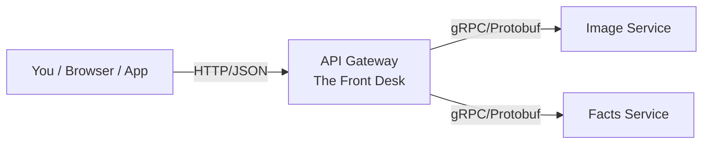
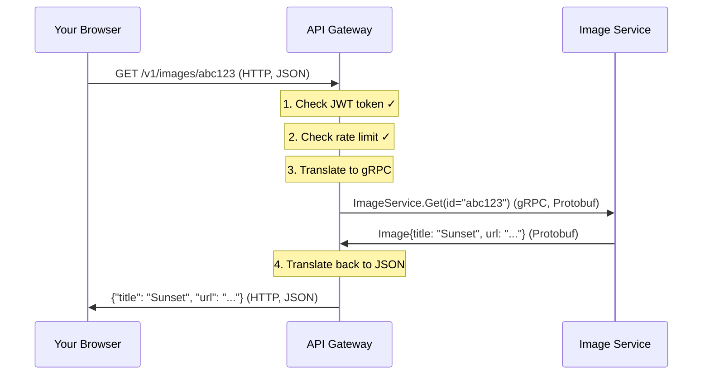
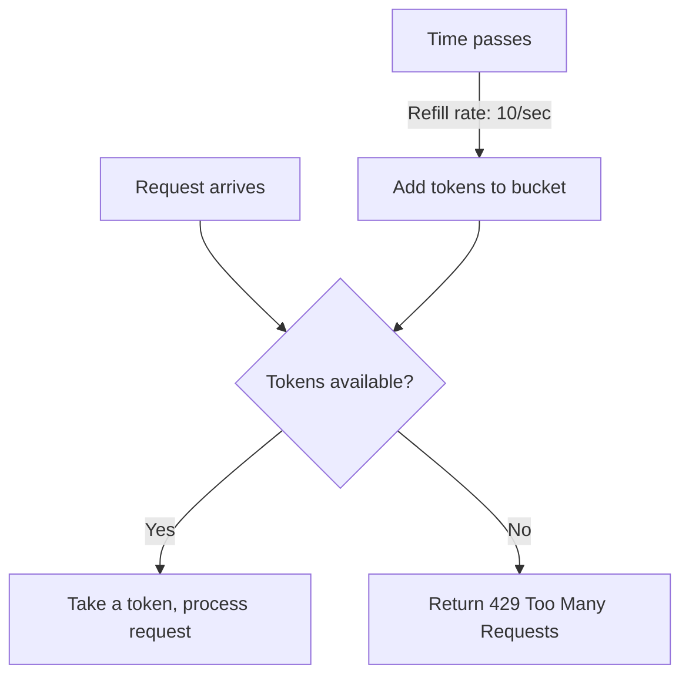
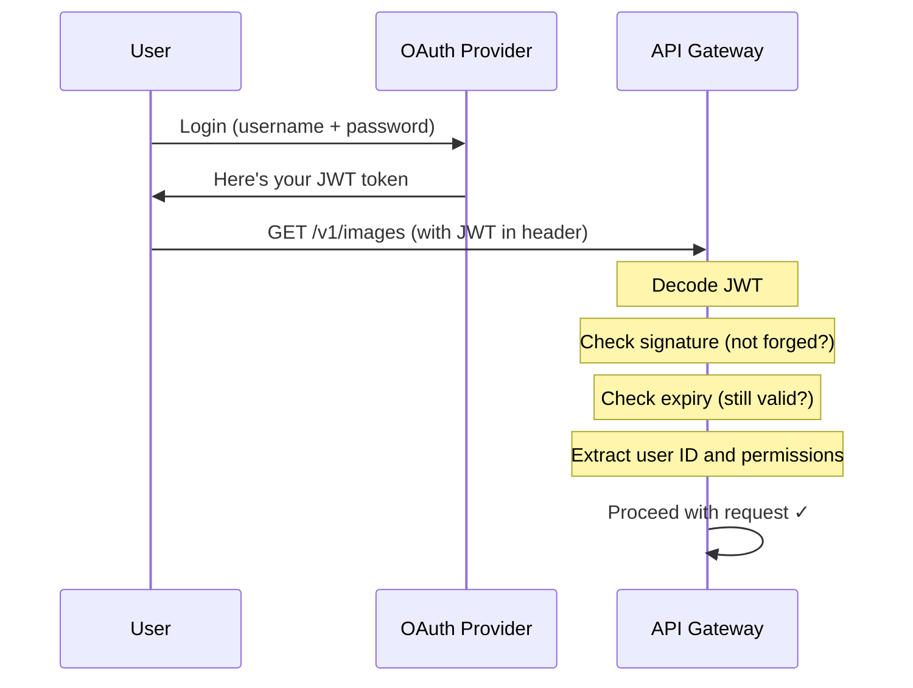
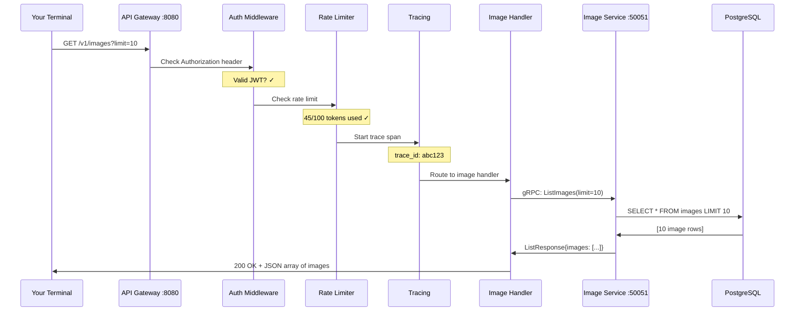

# API Gateway Design

*Explained like you're a smart 16-year-old who knows basic programming.*

---

## What Is an API Gateway?

Imagine you walk into a fancy hotel. You don't wander the hallways looking for housekeeping, the kitchen, or the concierge yourself. Instead, you go to the **front desk**. The person at the front desk:

1. Checks your ID (are you actually a guest?)
2. Makes sure you're not asking for 50 things at once (calm down, one request at a time)
3. Translates your request to the right department ("I need fresh towels" → calls housekeeping in their internal radio language)
4. Gives you back the answer in a way you understand

That's exactly what an **API Gateway** does for Voyager.



The user speaks HTTP (the language of the web). The internal services speak gRPC (a faster, stricter language). The gateway **translates** between them.

---

## Why Not Let Users Talk to Each Service Directly?

Good question! Here's why that's a bad idea:

| Without Gateway | With Gateway |
|----------------|--------------|
| Users need to know about every service URL | One URL for everything: `localhost:8080` |
| Each service needs its own auth code | Auth happens once, at the gateway |
| No rate limiting — someone can DDoS your image service | Gateway says "slow down buddy" |
| Service addresses change when you scale up | Gateway handles routing internally |
| Every service needs HTTPS certificates | Only the gateway needs a certificate |
| Can't log all requests centrally | Gateway logs everything in one place |

Think of it like this: you don't want every restaurant employee dealing with customers. You have a host/hostess at the door who manages the flow.

---

## How HTTP Becomes gRPC (The Translator)

**HTTP** is like sending a letter — it's text-based, flexible, and every web browser understands it.

**gRPC** is like a phone call between two machines — it's fast, uses a pre-agreed binary format (Protobuf), and both sides know exactly what data to expect.

Here's the translation that happens:



Why not just use HTTP everywhere? Because internally, gRPC is:
- **10x faster** (binary vs text)
- **Type-safe** (the proto file is a contract — no surprises)
- **Supports streaming** (get a live feed of new images)

---

## Rate Limiting (The Bouncer)

A **rate limiter** is like a bouncer at a club. Everyone can come in, but not all at once. And if someone's being too aggressive, they get told to wait.

Voyager uses a **token bucket** algorithm:

```
Imagine a bucket that holds 100 tokens.
Every second, 10 new tokens drop in.
Each request costs 1 token.
If the bucket is empty → "429 Too Many Requests"
```



This prevents:
- One user flooding the system with 10,000 requests/second
- A buggy script accidentally DDoS-ing your own service
- Unfair resource usage (one person hogging everything)

---

## Authentication (The ID Check)

Before the gateway does anything useful, it checks: **"Who are you, and can you prove it?"**

Voyager uses **JWT tokens** (JSON Web Tokens). Think of a JWT like a wristband at a concert:

1. You prove your identity once (log in, show your ticket)
2. You get a wristband (JWT token)
3. Every time you want to do something, you just show the wristband
4. The wristband has info encoded in it (your name, what areas you can access)
5. It expires after a while (you can't reuse yesterday's wristband)



The JWT contains **claims** like:
```json
{
  "sub": "user-123",
  "name": "Gaurav",
  "roles": ["uploader", "viewer"],
  "exp": 1750000000
}
```

---

## The Actual Go Code (Explained)

Here's `cmd/api-gateway/main.go` — the entry point for the API Gateway:

```go
package main

import (
    "context"
    "fmt"
    "net/http"
    "os"
    "os/signal"
    "syscall"
    "time"

    "go.uber.org/zap"
)
```

**What's happening**: We import packages we need. `net/http` is Go's built-in web server. `zap` is a super-fast structured logger (instead of `fmt.Println`). `context` helps us manage timeouts and cancellation.

```go
func main() {
    // Initialize structured logger
    logger, _ := zap.NewProduction()
    defer logger.Sync()
```

**What's happening**: Create a logger that outputs JSON (for machines to parse). `defer logger.Sync()` means "before this function exits, flush any buffered log messages." This is like saying "before you leave the house, make sure you turned off the stove."

```go
    logger.Info("Starting Voyager API Gateway",
        zap.String("version", "0.1.0"),
        zap.String("http_port", "8080"),
        zap.String("grpc_port", "9090"),
    )
```

**What's happening**: Log a startup message with structured fields. Unlike `fmt.Println("starting...")`, this creates JSON like `{"level":"info","msg":"Starting Voyager API Gateway","version":"0.1.0"}`. Machines (like Grafana) can search and filter these.

```go
    // HTTP server (REST → gRPC gateway)
    mux := http.NewServeMux()
```

**What's happening**: `ServeMux` is Go's URL router. It's like a switchboard: "If someone asks for `/health`, send them here. If they ask for `/v1/images`, send them there."

```go
    // Health check
    mux.HandleFunc("/health", func(w http.ResponseWriter, r *http.Request) {
        w.Header().Set("Content-Type", "application/json")
        fmt.Fprintf(w, `{"status":"ok","service":"api-gateway","version":"0.1.0"}`)
    })
```

**What's happening**: When someone hits `/health`, return a JSON response saying "I'm alive!" Kubernetes uses this every few seconds to check if the service is healthy. If it stops responding, Kubernetes restarts it automatically.

```go
    srv := &http.Server{
        Addr:         ":8080",
        Handler:      mux,
        ReadTimeout:  10 * time.Second,
        WriteTimeout: 30 * time.Second,
        IdleTimeout:  60 * time.Second,
    }
```

**What's happening**: Configure the HTTP server. The timeouts prevent slow/stuck connections from eating up resources:
- **ReadTimeout**: "If I can't read your request within 10 seconds, I'm hanging up"
- **WriteTimeout**: "If I can't send you a response within 30 seconds, something's wrong"
- **IdleTimeout**: "If you're just sitting there doing nothing for 60 seconds, goodbye"

```go
    // Graceful shutdown
    go func() {
        if err := srv.ListenAndServe(); err != nil && err != http.ErrServerClosed {
            logger.Fatal("HTTP server failed", zap.Error(err))
        }
    }()
```

**What's happening**: Start the server in a **goroutine** (Go's lightweight thread). This lets the main function continue running while the server handles requests. `go func()` is like saying "hey, handle this in the background."

```go
    // Wait for interrupt signal
    quit := make(chan os.Signal, 1)
    signal.Notify(quit, syscall.SIGINT, syscall.SIGTERM)
    <-quit
```

**What's happening**: Wait for someone to press Ctrl+C or for Kubernetes to send a shutdown signal. `<-quit` blocks here like a `input()` in Python — it just waits.

```go
    logger.Info("Shutting down gracefully...")
    ctx, cancel := context.WithTimeout(context.Background(), 10*time.Second)
    defer cancel()

    if err := srv.Shutdown(ctx); err != nil {
        logger.Fatal("Server forced to shutdown", zap.Error(err))
    }

    logger.Info("Server exited cleanly")
}
```

**What's happening**: **Graceful shutdown**. Instead of immediately killing the server (which would drop in-progress requests), we:
1. Stop accepting new connections
2. Wait up to 10 seconds for current requests to finish
3. Then exit cleanly

This is critical in Kubernetes. When a pod is being replaced, it gets a SIGTERM, finishes what it's doing, then dies gracefully.

---

## What Happens When You `curl http://localhost:8080/v1/images`

Let's trace a real request through the entire system:



Step by step:

1. **Your terminal** sends an HTTP GET request
2. **The router** matches `/v1/images` to the image handler
3. **Auth middleware** extracts and validates your JWT token
4. **Rate limiter** checks if you've used too many requests recently
5. **Tracing middleware** creates a trace ID (so we can follow this request across services)
6. **Image handler** converts your HTTP request into a gRPC call
7. **Image service** receives the gRPC call and queries PostgreSQL
8. **Response flows back**: DB → Image Service → Handler → Gateway → You

All of this happens in **milliseconds**. The user just sees a JSON response.

---

## Key Takeaways

| Concept | Analogy | What It Does |
|---------|---------|--------------|
| API Gateway | Hotel front desk | Single entry point, translates, protects |
| Rate Limiting | Club bouncer | Prevents abuse, ensures fairness |
| Authentication | Concert wristband | Proves identity without re-login |
| Graceful Shutdown | Finishing your sentence before leaving | Doesn't drop in-progress requests |
| Goroutine | Background thread (but cheaper) | Server runs without blocking main |
| ServeMux | Phone switchboard | Routes URLs to handlers |
