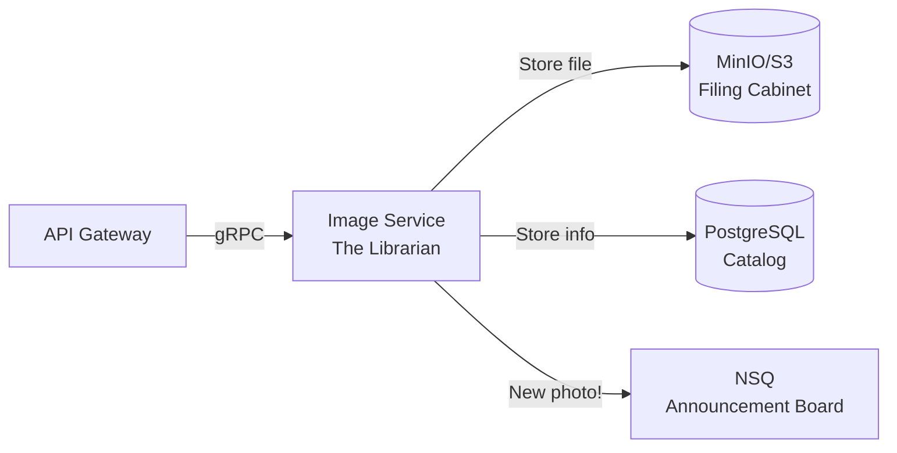
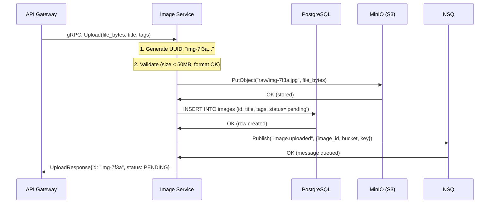

# Image Service Design

*Explained like you're a smart 16-year-old who knows basic programming.*

---

## What Does This Service Do?

Think of the Image Service as a **librarian for photos**. When someone brings in a new photo:

1. The librarian gives it a unique ID (like a library card number)
2. Stores the actual photo in a filing cabinet (MinIO/S3)
3. Writes down information about it in a catalog (PostgreSQL)
4. Tells the processing team "hey, new photo needs resizing" (NSQ message)
5. When someone asks for a photo, the librarian finds it and hands it over

The Image Service doesn't talk to users directly. It only talks to the API Gateway (via gRPC). It's like a back-office employee who never meets customers face-to-face.



---

## gRPC vs REST — Why Talk Differently Inside vs Outside?

Imagine two ways of communicating:

**REST** (what browsers use): Like writing letters. You write in English, put it in an envelope, mail it. Flexible, everyone understands it, but slow.

**gRPC** (what services use internally): Like a walkie-talkie with a codebook. Both sides agreed on codes beforehand. "Code 7" means "give me image with this ID." Super fast, no ambiguity, but you need the codebook.

| Feature | REST (External) | gRPC (Internal) |
|---------|----------------|-----------------|
| Format | JSON (text) | Protobuf (binary) |
| Speed | Good | 10x faster |
| Type safety | Loose (anything goes) | Strict (defined by .proto file) |
| Browser support | ✅ Yes | ❌ No (needs special client) |
| Streaming | Hacky (WebSocket) | Built-in |
| File size | Larger (text) | Smaller (binary) |

**Why use both?** Browsers and mobile apps need REST. But between our own services (where we control both sides), gRPC is faster and safer. The API Gateway is the translator between these two worlds.

---

## Protobuf — Why Not Just Use JSON?

**Protobuf** (Protocol Buffers) is Google's way of defining data structures. Think of it like a contract between services.

### The Problem with JSON

```json
{
  "image_id": "abc123",        // Is this "id" or "image_id"? Who knows
  "title": "Sunset",
  "tags": "nature,mountains"   // Is this a string or array? Depends on mood
}
```

With JSON, there's no guarantee about:
- What fields exist
- What types they are
- Whether they're required or optional

### The Protobuf Solution

```protobuf
message Image {
  string id = 1;                    // Always a string, always field #1
  string title = 2;                 // Required
  repeated string tags = 4;         // Always an array of strings
  ImageStatus status = 7;           // Must be one of the defined enum values
}
```

This `.proto` file generates Go code automatically. If someone tries to send the wrong type, it won't even compile. It's like having a spell-checker that catches errors before you send the email.

| | JSON | Protobuf |
|---|------|----------|
| Human readable? | ✅ Yes | ❌ Binary |
| Self-describing? | ✅ Yes | ❌ Need .proto file |
| Type safe? | ❌ No | ✅ Yes |
| File size | Larger | 3-10x smaller |
| Parse speed | Slower | Much faster |
| Code generation | Manual | Automatic |
| Schema evolution | Break things easily | Backward compatible |

---

## How Upload Works — Step by Step

Let's follow a photo from your phone to being fully stored:



**Why "pending" status?** The image is stored, but hasn't been processed yet (no thumbnail, no EXIF data extracted). The Worker Service will do that asynchronously. We don't make the user wait for all that processing.

---

## Database Schema — Why Tables and Indexes?

### The Images Table

```sql
CREATE TABLE images (
    id UUID PRIMARY KEY DEFAULT gen_random_uuid(),
    title VARCHAR(255) NOT NULL,
    description TEXT,
    tags TEXT[] DEFAULT '{}',
    status VARCHAR(20) DEFAULT 'pending',
    url TEXT,
    thumbnail_url TEXT,
    width INT,
    height INT,
    format VARCHAR(10),
    size_bytes BIGINT,
    exif JSONB DEFAULT '{}',
    uploader_id VARCHAR(100),
    created_at TIMESTAMPTZ DEFAULT NOW(),
    updated_at TIMESTAMPTZ DEFAULT NOW()
);
```

Let's break this down:

| Column | Type | Why |
|--------|------|-----|
| `id` | UUID | Globally unique, no collisions even across multiple servers |
| `title` | VARCHAR(255) | Titles don't need to be novels. Limit prevents abuse |
| `tags` | TEXT[] | PostgreSQL arrays! Can search "find all images tagged 'nature'" |
| `status` | VARCHAR(20) | Tracks: pending → processing → ready → failed |
| `exif` | JSONB | Flexible JSON field for camera data, GPS, etc. Structure varies per image |
| `created_at` | TIMESTAMPTZ | Always store with timezone. "When was this uploaded?" |

### Why Indexes?

Imagine a book without a table of contents. To find chapter 7, you'd flip through every single page. **Indexes** are the table of contents for your database.

```sql
CREATE INDEX idx_images_status ON images(status);
CREATE INDEX idx_images_tags ON images USING GIN(tags);
CREATE INDEX idx_images_created ON images(created_at DESC);
```

| Index | What It Speeds Up | When It's Used |
|-------|-------------------|---------------|
| `idx_images_status` | `WHERE status = 'ready'` | Showing only processed images in feed |
| `idx_images_tags` | `WHERE 'nature' = ANY(tags)` | Searching by tag (GIN = special array index) |
| `idx_images_created` | `ORDER BY created_at DESC` | "Show newest first" (the feed) |

Without these indexes, every query scans the entire table. With them, it's like jumping to the right page instantly.

---

## Object Storage (MinIO/S3) — Why Not Just Save Files on Disk?

### The Problem with Disk Storage

```
# This seems simple, right?
/var/images/abc123.jpg
/var/images/abc124.jpg
```

But what happens when:
- Your server's disk fills up? (💀)
- You have 3 servers — which one has the file? 
- Your server dies and the disk is gone? (no backup!)
- You need to serve images from a CDN? (can't, it's on one machine)

### The Object Storage Solution

**MinIO** (or AWS S3) is like a magical unlimited filing cabinet:

| Feature | Disk | MinIO/S3 |
|---------|------|----------|
| Storage limit | Size of your hard drive | Virtually unlimited |
| Redundancy | Gone if server dies | Replicated automatically |
| Access from multiple servers | ❌ Only local | ✅ Any server, anywhere |
| CDN integration | Manual work | Built-in |
| Cost at scale | Buy bigger drives | Pay per GB used |
| Presigned URLs | Not possible | ✅ Temporary download links |

### How Voyager Uses Object Storage

```
voyager-images/                  ← Bucket (like a top-level folder)
├── raw/
│   ├── img-7f3a.jpg            ← Original upload
│   └── img-8b2c.png
├── thumb/
│   ├── img-7f3a.jpg            ← 300px thumbnail (created by worker)
│   └── img-8b2c.png
└── medium/
    ├── img-7f3a.jpg            ← 1200px version (created by worker)
    └── img-8b2c.png
```

**Presigned URLs**: Instead of proxying large files through our service, we generate a temporary URL that lets the user download directly from MinIO. The URL expires after 15 minutes. This is like giving someone a visitor badge that only works for 15 minutes.

---

## The Go Code — Key Patterns

### The gRPC Server Setup

```go
package main

import (
    "net"
    "os"
    "os/signal"
    "syscall"

    "go.uber.org/zap"
    "google.golang.org/grpc"
    "google.golang.org/grpc/health"
    healthpb "google.golang.org/grpc/health/grpc_health_v1"
    "google.golang.org/grpc/reflection"
)

func main() {
    logger, _ := zap.NewProduction()
    defer logger.Sync()
```

**What's happening**: Same structured logger as the gateway. Every service starts the same way — consistency makes debugging easier.

```go
    // Create gRPC server with interceptors
    srv := grpc.NewServer(
    // grpc.UnaryInterceptor(otelgrpc.UnaryServerInterceptor()),
    // grpc.StreamInterceptor(otelgrpc.StreamServerInterceptor()),
    )
```

**What's happening**: Create a gRPC server. **Interceptors** are like middleware in HTTP — they wrap every request to add logging, tracing, or auth. `UnaryInterceptor` handles one-request-one-response calls. `StreamInterceptor` handles streaming calls.

```go
    // Register health check
    healthSrv := health.NewServer()
    healthpb.RegisterHealthServer(srv, healthSrv)
```

**What's happening**: Register a health check endpoint. Kubernetes sends periodic "are you alive?" gRPC calls to this. If the service doesn't respond, Kubernetes replaces it with a new pod.

```go
    // Enable reflection for grpcurl/grpcui
    reflection.Register(srv)
```

**What's happening**: **Reflection** lets debugging tools (like `grpcurl`) discover what methods your service offers without needing the .proto file. It's like a service saying "here's my menu" when asked.

```go
    // Listen on TCP port 50051
    lis, err := net.Listen("tcp", ":50051")
    if err != nil {
        logger.Fatal("Failed to listen", zap.Error(err))
    }

    // Serve in goroutine
    go func() {
        if err := srv.Serve(lis); err != nil {
            logger.Fatal("gRPC server failed", zap.Error(err))
        }
    }()
```

**What's happening**: Start listening for gRPC connections on port 50051. Same pattern as the gateway — run the server in the background, keep the main goroutine free.

```go
    // Graceful shutdown (same pattern as gateway)
    quit := make(chan os.Signal, 1)
    signal.Notify(quit, syscall.SIGINT, syscall.SIGTERM)
    <-quit

    srv.GracefulStop()  // Finish in-progress RPCs before stopping
}
```

**What's happening**: Same graceful shutdown pattern. `GracefulStop()` finishes ongoing RPCs before shutting down (vs `Stop()` which kills everything immediately).

### The Interface Pattern (Dependency Injection)

```go
// This interface defines WHAT the repository can do
type ImageRepository interface {
    Create(ctx context.Context, img *Image) (string, error)
    GetByID(ctx context.Context, id string) (*Image, error)
    List(ctx context.Context, filter ListFilter) ([]*Image, error)
    UpdateStatus(ctx context.Context, id string, status Status) error
    Delete(ctx context.Context, id string) error
}

// This struct implements it with PostgreSQL
type postgresRepo struct {
    db *pgxpool.Pool
}

func (r *postgresRepo) Create(ctx context.Context, img *Image) (string, error) {
    // actual SQL query here
}
```

**Why interfaces?** In tests, you can swap in a fake repository:

```go
type mockRepo struct {
    images map[string]*Image
}

func (m *mockRepo) GetByID(ctx context.Context, id string) (*Image, error) {
    return m.images[id], nil  // no database needed!
}
```

This is called **dependency injection** — the service doesn't care if it's talking to a real database or a fake one in tests.

---

## Key Takeaways

| Concept | Analogy | Why It Matters |
|---------|---------|---------------|
| gRPC Service | Back-office employee | Fast, focused, doesn't deal with public |
| Protobuf | Legally binding contract | Both sides agree on exact format |
| UUID | Social security number | Globally unique, no collisions |
| Object Storage | Infinite filing cabinet | Scales, survives server death |
| Presigned URLs | Temporary visitor badge | Direct access without proxying |
| Indexes | Book's table of contents | Find data without scanning everything |
| Interfaces | Job description | Can swap implementations (real vs mock) |
| Graceful Shutdown | Finishing your sentence | Don't drop in-progress work |
