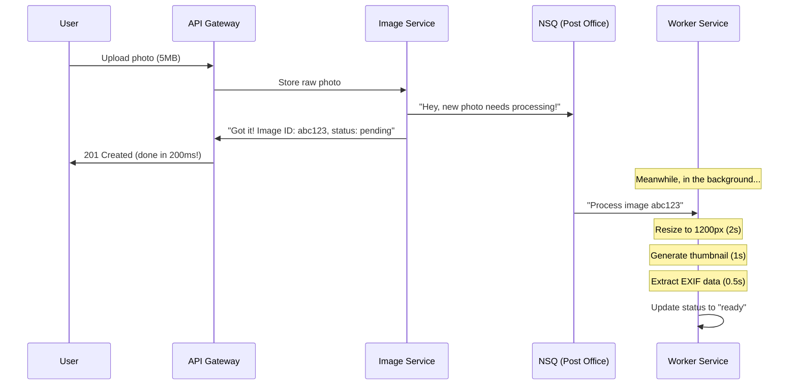
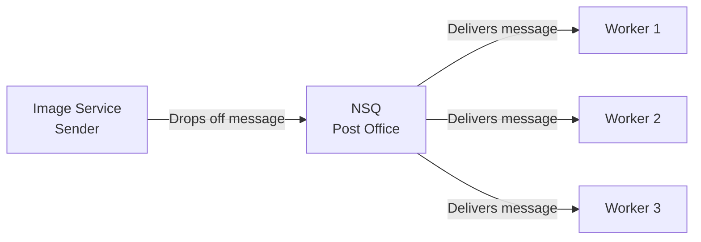
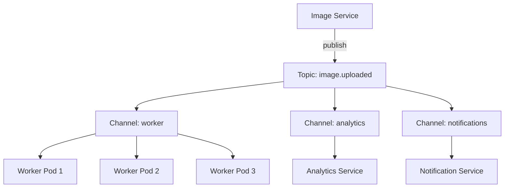
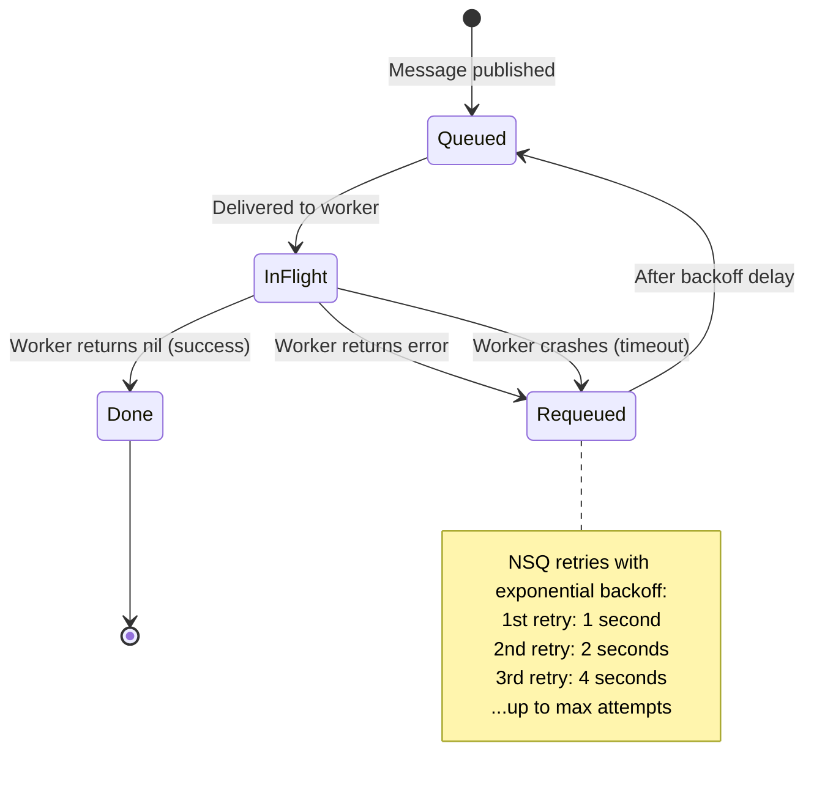
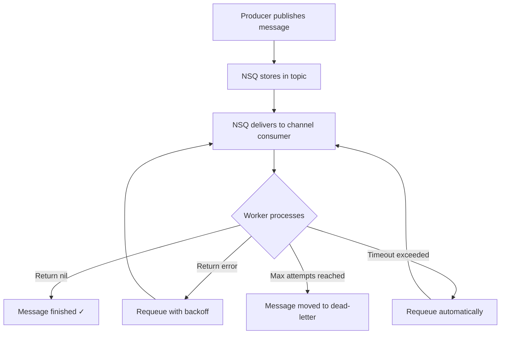
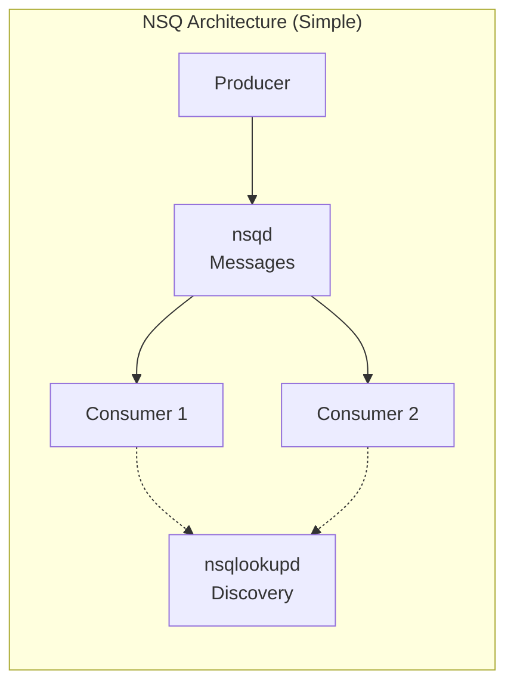
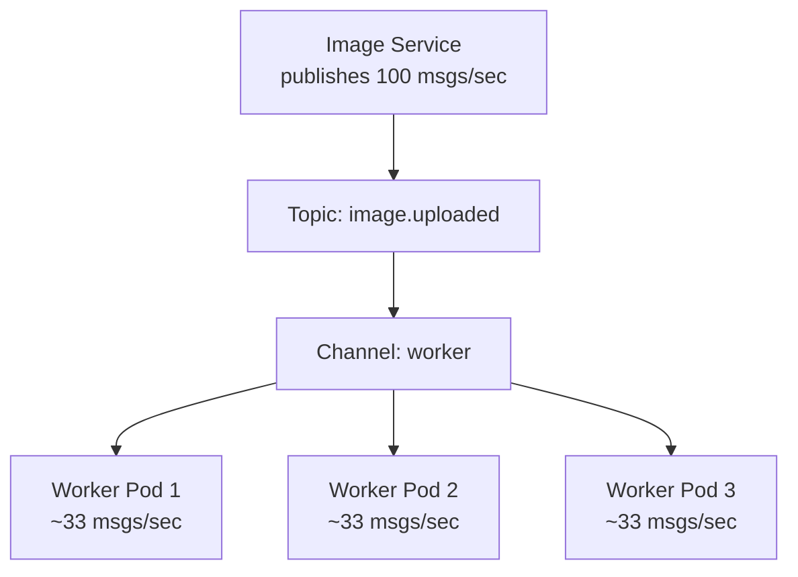

# NSQ & Async Processing Design

*Explained like you're a smart 16-year-old who knows basic programming.*

---

## Why Not Process Images Immediately?

Let's use a **pizza delivery analogy**.

You order a pizza online. The restaurant has two options:

**Option A (Synchronous):** Make you wait on the phone until the pizza is cooked, boxed, and delivered. You're just... sitting there. For 30 minutes. Doing nothing.

**Option B (Asynchronous):** Take your order, say "got it, order #42!", and hang up. They cook and deliver in the background. You get a notification when it's ready.

Voyager uses Option B for image processing:



If we did it synchronously, the user would wait 3.5+ seconds. With async processing, they wait ~200ms and the heavy work happens in the background.

---

## What Is NSQ?

NSQ is a **message queue** think of it as a **post office for services**.



Here's the analogy:
- **Image Service** = person dropping off a letter at the post office
- **NSQ** = the post office (holds the letter, makes sure it gets delivered)
- **Worker Service** = the recipient (processes the letter when ready)

The sender doesn't need to know (or care) if the recipient is busy, sleeping, or on vacation. The post office holds the message until the recipient comes to pick it up.

---

## Topics and Channels Explained

NSQ has two key concepts:

### Topic = What's the message about?

A topic is like a mailbox category. Voyager has:
- `image.uploaded` "a new image was uploaded and needs processing"
- `image.processed` "an image has been processed successfully"

### Channel = Who's reading the messages?

A channel is like a subscription. Multiple consumers can subscribe to the same topic:



**Key rule**: Each message is delivered to **every channel**, but within a channel, only **one consumer** gets each message.

This means:
- Worker pods share the load (message goes to only one of them)
- But analytics AND workers both get every message (different channels)

Think of it like a newspaper:
- Each subscriber (channel) gets a copy
- If a family shares one subscription, only one person reads each article first

---

## Producer vs Consumer

### Producer: Image Service Publishes

When an image is uploaded, the Image Service publishes a message:

```go
package messaging

import (
    "encoding/json"
    "github.com/nsqio/go-nsq"
    "go.uber.org/zap"
)

// MessagePublisher wraps NSQ producer
type MessagePublisher struct {
    producer *nsq.Producer
    logger   *zap.Logger
}

// NewPublisher connects to NSQ
func NewPublisher(nsqdAddr string, logger *zap.Logger) (*MessagePublisher, error) {
    cfg := nsq.NewConfig()
    producer, err := nsq.NewProducer(nsqdAddr, cfg)
    if err != nil {
        return nil, err
    }

    return &MessagePublisher{producer: producer, logger: logger}, nil
}

// ImageUploadedEvent is what we send when a new image arrives
type ImageUploadedEvent struct {
    ImageID    string `json:"image_id"`
    Bucket     string `json:"bucket"`
    Key        string `json:"key"`
    UploadedAt string `json:"uploaded_at"`
    UploaderID string `json:"uploader_id"`
}

// PublishImageUploaded sends the event to NSQ
func (p *MessagePublisher) PublishImageUploaded(event ImageUploadedEvent) error {
    body, err := json.Marshal(event)
    if err != nil {
        return err
    }

    p.logger.Info("Publishing image.uploaded event",
        zap.String("image_id", event.ImageID),
    )

    return p.producer.Publish("image.uploaded", body)
}
```

**What's happening**:
1. We create a connection to NSQ (like opening a post office account)
2. When an image is uploaded, we encode the event as JSON
3. We publish it to the `image.uploaded` topic
4. NSQ stores it and delivers it to all subscribed channels

### Consumer: Worker Service Subscribes

The Worker Service listens for new messages and processes them:

```go
package worker

import (
    "encoding/json"
    "github.com/nsqio/go-nsq"
    "go.uber.org/zap"
)

// ImageProcessor handles incoming image processing messages
type ImageProcessor struct {
    storage StorageClient
    repo    ImageRepository
    logger  *zap.Logger
}

// HandleMessage is called by NSQ for each message
func (p *ImageProcessor) HandleMessage(msg *nsq.Message) error {
    var event ImageUploadedEvent
    if err := json.Unmarshal(msg.Body, &event); err != nil {
        p.logger.Error("Failed to parse message", zap.Error(err))
        return err  // returning error = message will be requeued
    }

    p.logger.Info("Processing image",
        zap.String("image_id", event.ImageID),
    )

    // 1. Download raw image from MinIO
    raw, err := p.storage.Download(event.Bucket, event.Key)
    if err != nil {
        return err  // will retry!
    }

    // 2. Generate thumbnail (300px)
    thumb, err := resize(raw, 300)
    if err != nil {
        return err
    }

    // 3. Generate medium version (1200px)
    medium, err := resize(raw, 1200)
    if err != nil {
        return err
    }

    // 4. Extract EXIF data
    exif, _ := extractEXIF(raw)  // OK if this fails (not all images have EXIF)

    // 5. Upload processed versions back to MinIO
    p.storage.Upload("voyager-images", "thumb/"+event.ImageID+".jpg", thumb)
    p.storage.Upload("voyager-images", "medium/"+event.ImageID+".jpg", medium)

    // 6. Update database: status → "ready"
    p.repo.UpdateStatus(event.ImageID, StatusReady, exif)

    p.logger.Info("Image processing complete",
        zap.String("image_id", event.ImageID),
    )

    return nil  // returning nil = message acknowledged (done!)
}

// StartConsumer connects to NSQ and starts consuming messages
func StartConsumer(nsqLookupdAddr string, processor *ImageProcessor) error {
    cfg := nsq.NewConfig()
    cfg.MaxInFlight = 5  // Process up to 5 messages concurrently

    consumer, err := nsq.NewConsumer("image.uploaded", "worker", cfg)
    if err != nil {
        return err
    }

    consumer.AddHandler(processor)
    return consumer.ConnectToNSQLookupd(nsqLookupdAddr)
}
```

**What's happening**:
1. We create a consumer that subscribes to `image.uploaded` topic on the `worker` channel
2. For each message, `HandleMessage` is called
3. We download the raw image, create variants, extract EXIF data
4. If anything fails, we return an error → NSQ will try again later
5. If everything succeeds, we return nil → NSQ marks the message as done

---

## What Happens If the Worker Crashes?

This is where message queues really shine. Let's compare:

### Without NSQ (direct calls):

```
Image Service: "Hey Worker, process this image!"
Worker: *crashes*
Image Service: "...hello? Is anyone there?"
Result: Image is lost forever. User is sad. 😢
```

### With NSQ:

```
Image Service: "Hey NSQ, hold this message"
NSQ: "Got it, stored safely ✓"
Worker: *crashes*
NSQ: "Hmm, worker didn't acknowledge. I'll wait..."
Worker: *restarts*
NSQ: "Oh you're back! Here's that message again"
Worker: "Got it, processing now!"
Result: Image is processed eventually. User is happy. 🎉
```



**NSQ guarantees "at-least-once delivery"**: every message will be processed at least once. The trade-off is that if a worker processes a message but crashes before acknowledging, it might get processed twice. That's why our processing code should be **idempotent** (running it twice produces the same result).

---

## Message Lifecycle



---

## NSQ Configuration in Voyager

```go
cfg := nsq.NewConfig()

// How many messages can one worker handle simultaneously
cfg.MaxInFlight = 5

// How long NSQ waits before considering a message "timed out"
cfg.MsgTimeout = 60 * time.Second  // Image processing can take a while!

// Retry strategy
cfg.MaxAttempts = 5  // Try 5 times before giving up
cfg.LookupdPollInterval = 15 * time.Second  // How often to discover new NSQ nodes
```

---

## Why NSQ Over Kafka?

You might have heard of Apache Kafka it's the "big name" in messaging. So why choose NSQ?

| Feature | NSQ | Kafka |
|---------|-----|-------|
| Setup complexity | `docker run nsqio/nsq` (done!) | Kafka + ZooKeeper + Schema Registry |
| Configuration | Almost zero | Hundreds of knobs |
| Operational overhead | Minimal (no ZooKeeper!) | Need dedicated team |
| Message ordering | Per-consumer (good enough) | Strict per-partition |
| Replay messages | ❌ No | ✅ Yes (keep messages forever) |
| Throughput | Millions/sec | Billions/sec |
| Cluster management | nsqlookupd (simple) | Complex partition rebalancing |
| Learning curve | 1 day | 1 month |
| When to use | Microservices, task queues, moderate scale | Event sourcing, log streaming, massive scale |

**The bottom line**: Kafka is overkill for Voyager's needs. We're processing maybe thousands of images per hour, not billions of events per second. NSQ gives us reliable async messaging with 1% of Kafka's operational complexity.



NSQ has just two components:
- **nsqd**: Stores and delivers messages (the actual post office)
- **nsqlookupd**: Helps consumers find which nsqd has their messages (the directory)

Compare that to Kafka's: brokers + ZooKeeper + Schema Registry + Connect + multiple config files. For our scale, simpler is better.

---

## The Actual Worker Service Code

Here's `cmd/worker-svc/main.go`:

```go
package main

import (
    "os"
    "os/signal"
    "syscall"

    "go.uber.org/zap"
)

func main() {
    logger, _ := zap.NewProduction()
    defer logger.Sync()

    logger.Info("Starting Voyager Worker Service",
        zap.String("version", "0.1.0"),
    )

    // Connect to NSQ and start consuming
    // consumer, err := nsq.NewConsumer("image.uploaded", "worker", nsq.NewConfig())
    // consumer.AddHandler(nsq.HandlerFunc(processImage))
    // consumer.ConnectToNSQLookupd("nsqlookupd:4161")

    logger.Info("Worker Service running, waiting for messages...")

    // Wait for shutdown signal
    quit := make(chan os.Signal, 1)
    signal.Notify(quit, syscall.SIGINT, syscall.SIGTERM)
    <-quit

    logger.Info("Shutting down Worker Service...")
    // consumer.Stop()
    logger.Info("Worker Service stopped")
}
```

**Key pattern**: The worker doesn't expose any ports! It's purely a consumer. It connects to NSQ, waits for messages, processes them, and that's it. No HTTP server, no gRPC server just a message handler sitting quietly in the background.

---

## How Scaling Works with NSQ

The beauty of the channel model:



When the queue gets deep (too many unprocessed messages), Kubernetes automatically spins up more worker pods. NSQ distributes messages evenly across all consumers in the same channel. No code changes needed just add more workers!

---

## Key Takeaways

| Concept | Analogy | Why It Matters |
|---------|---------|---------------|
| Async processing | Pizza delivery (order → hang up → wait) | Users don't wait for slow operations |
| NSQ | Post office | Reliable message delivery, even if recipients are busy |
| Topic | Mailbox category | Organize messages by type |
| Channel | Subscription | Multiple services can subscribe to same events |
| At-least-once delivery | Certified mail | Messages never disappear, might arrive twice |
| Idempotent processing | Pressing elevator button twice | Same result whether processed once or twice |
| Consumer groups | Workers sharing a inbox | Scale by adding more workers |
| Dead-letter queue | Return to sender | Messages that failed too many times |
