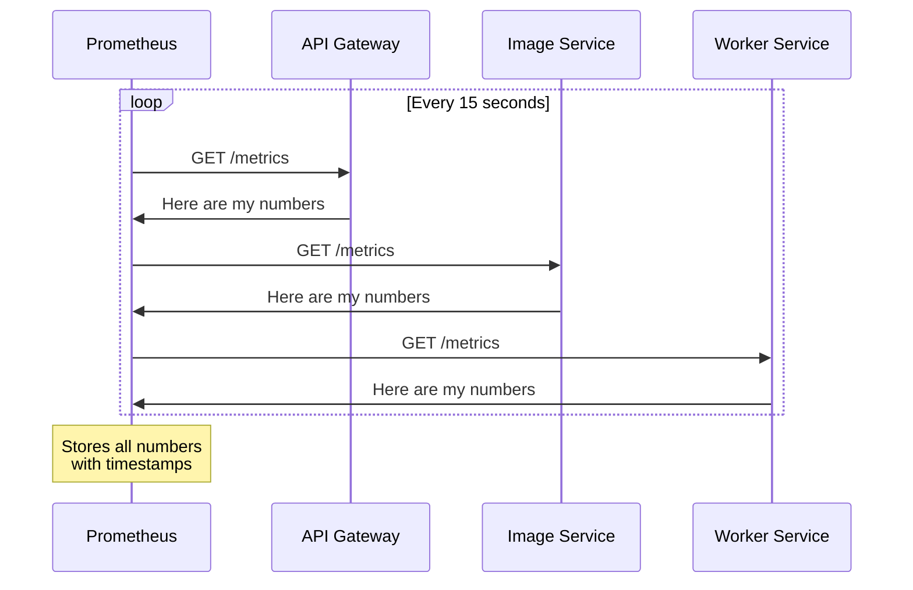
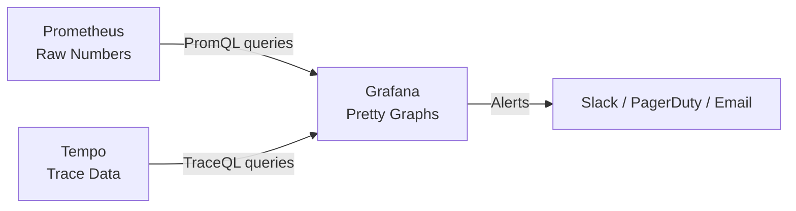
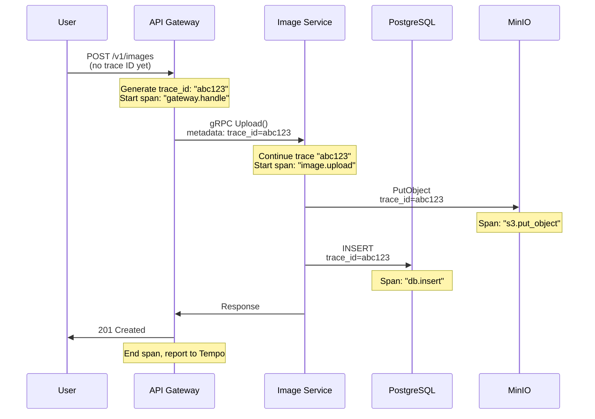
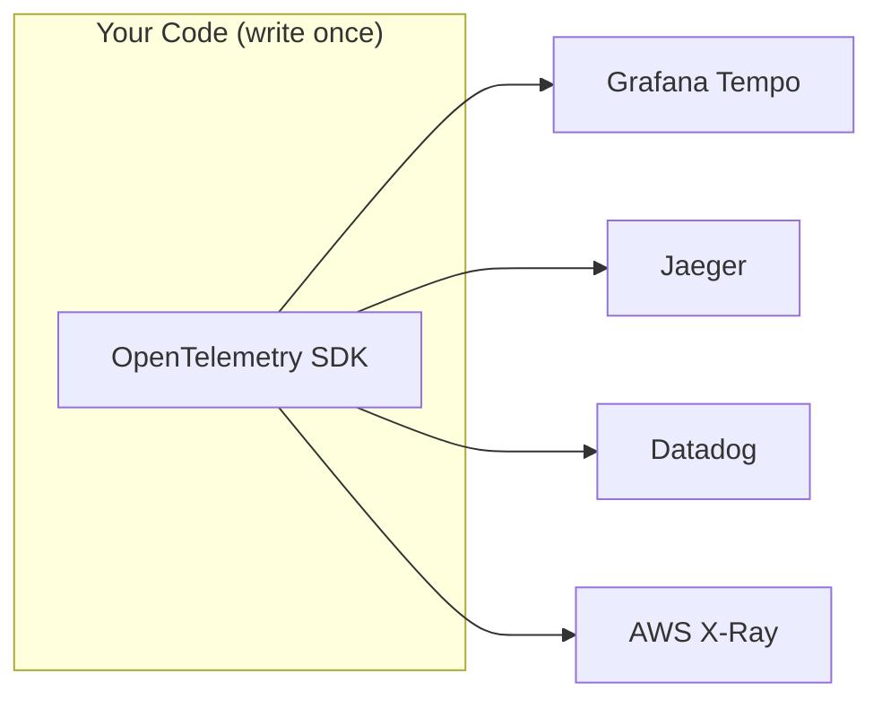
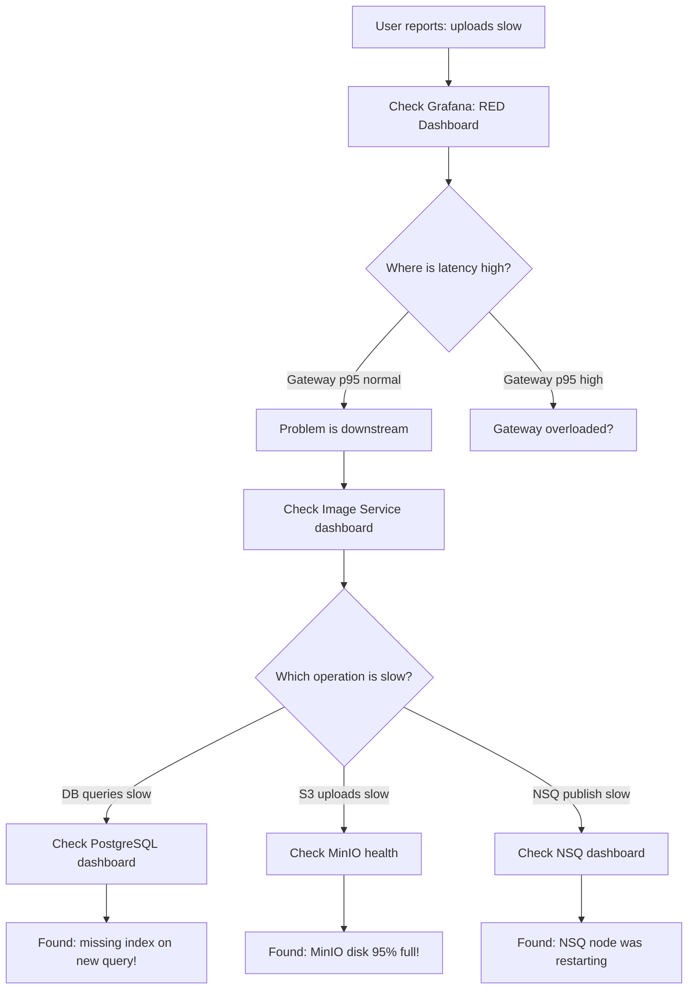

# Monitoring, Metrics & Tracing Design

*Explained like you're a smart 16-year-old who knows basic programming.*

---

## Why Observe? (The Car Dashboard Analogy)

Imagine driving a car with no dashboard. No speedometer, no fuel gauge, no temperature warning light. You're flying blind. You won't know something's wrong until the engine explodes.

**Observability** is the dashboard for your software:

| Car Dashboard | Software Observability |
|--------------|----------------------|
| Speedometer | Request rate (requests/second) |
| Fuel gauge | Memory usage, disk space |
| Temperature warning | Error rate spike |
| Odometer | Total requests served |
| Check engine light | Alert: "something's broken!" |
| GPS/trip history | Distributed tracing (where did the request go?) |

Voyager has three pillars of observability:

```mermaid
graph TB
    subgraph "The Three Pillars"
        M[Metrics<br/>Prometheus<br/>"What's happening NOW?"]
        L[Logs<br/>Structured JSON<br/>"What happened step by step?"]
        T[Traces<br/>Tempo<br/>"What path did this request take?"]
    end

    M --> G[Grafana<br/>Visualization + Alerts]
    L --> G
    T --> G
```

---

## Prometheus: Counting and Timing Everything

**Prometheus** is a metrics database. Think of it like a fitness tracker for your services it records numbers over time.

### How It Works



Prometheus uses a **pull model** it comes to your services and asks "what are your numbers?" every 15 seconds. This is different from most systems where you push data to a central collector.

### Types of Metrics

| Type | What It Tracks | Example |
|------|---------------|---------|
| **Counter** | Things that only go up | Total requests served: 1, 2, 3, 4... |
| **Gauge** | Things that go up and down | Current active connections: 5, 3, 7, 2 |
| **Histogram** | Distribution of values | Request duration: 50% under 10ms, 95% under 50ms, 99% under 200ms |

### Voyager's Key Metrics

```go
// These metrics are defined in our services:

// Counter - "how many requests total?"
var httpRequestsTotal = prometheus.NewCounterVec(
    prometheus.CounterOpts{
        Name: "voyager_http_requests_total",
        Help: "Total HTTP requests handled",
    },
    []string{"method", "path", "status"},  // Labels for filtering
)

// Histogram - "how long do requests take?"
var httpRequestDuration = prometheus.NewHistogramVec(
    prometheus.HistogramOpts{
        Name:    "voyager_http_request_duration_seconds",
        Help:    "HTTP request duration in seconds",
        Buckets: []float64{0.001, 0.005, 0.01, 0.05, 0.1, 0.5, 1, 5},
    },
    []string{"method", "path"},
)

// Gauge - "how many connections right now?"
var dbConnectionsActive = prometheus.NewGauge(
    prometheus.GaugeOpts{
        Name: "voyager_db_connections_active",
        Help: "Number of active database connections",
    },
)
```

### What `/metrics` Looks Like

When Prometheus hits `http://api-gateway:8080/metrics`, it gets back:

```
# HELP voyager_http_requests_total Total HTTP requests handled
# TYPE voyager_http_requests_total counter
voyager_http_requests_total{method="GET",path="/v1/images",status="200"} 1847
voyager_http_requests_total{method="GET",path="/v1/images",status="404"} 23
voyager_http_requests_total{method="POST",path="/v1/images",status="201"} 412

# HELP voyager_http_request_duration_seconds HTTP request duration
# TYPE voyager_http_request_duration_seconds histogram
voyager_http_request_duration_seconds_bucket{method="GET",path="/v1/images",le="0.01"} 1200
voyager_http_request_duration_seconds_bucket{method="GET",path="/v1/images",le="0.05"} 1750
voyager_http_request_duration_seconds_bucket{method="GET",path="/v1/images",le="0.1"} 1840
```

This is plain text. Prometheus scrapes it, stores it with a timestamp, and you can query it later.

---

## Grafana: The Pretty Dashboard

**Grafana** takes those raw numbers from Prometheus and turns them into beautiful, real-time graphs.



### Voyager's Pre-Built Dashboards

| Dashboard | What It Shows | When To Use |
|-----------|--------------|-------------|
| **Service Overview (RED)** | Rate, Errors, Duration per service | Daily health check |
| **gRPC Performance** | Per-method latency, error codes | Debugging slow calls |
| **NSQ Health** | Queue depth, in-flight, requeue rate | Are workers keeping up? |
| **Infrastructure** | CPU, memory, pod restarts | Resource issues |
| **Business Metrics** | Uploads/hour, processing success | Product health |

### PromQL: The Query Language

Grafana uses **PromQL** to ask questions about your metrics:

```promql
# "What's the request rate over the last 5 minutes?"
rate(voyager_http_requests_total[5m])

# "What's the 95th percentile response time?"
histogram_quantile(0.95, rate(voyager_http_request_duration_seconds_bucket[5m]))

# "What percentage of requests are failing?"
sum(rate(voyager_http_requests_total{status=~"5.."}[5m]))
/
sum(rate(voyager_http_requests_total[5m]))
* 100

# "How deep is the NSQ queue?"
voyager_nsq_queue_depth{topic="image.uploaded"}
```

---

## Tempo: Following a Request Across Services (Detective Story)

Imagine a user says "my image upload was slow." You have 4 services. Where did the time go? It's a detective story, and **distributed tracing** is your investigation tool.

### What Is a Trace?

A **trace** follows one request as it travels through the entire system. Each step is called a **span**.

```mermaid
gantt
    title Trace: Image Upload (total: 1.2s)
    dateFormat X
    axisFormat %L ms

    section API Gateway
    gateway.handle_request           :0, 1200

    section Image Service
    image.upload                     :50, 1100
    image.validate                   :60, 80
    image.store_file                 :80, 700
    image.insert_metadata            :700, 900
    image.publish_event              :900, 950

    section PostgreSQL
    db.insert                        :710, 890

    section MinIO
    s3.put_object                    :90, 690
```



Now you can see: "Ah-ha! The S3 upload took 600ms. That's where the slowness is!"

### How Tracing Works in Code

```go
import "go.opentelemetry.io/otel"

func (s *imageServer) Upload(ctx context.Context, req *UploadRequest) (*UploadResponse, error) {
    // Start a new span (timing starts here)
    ctx, span := otel.Tracer("image-svc").Start(ctx, "image.upload")
    defer span.End()  // Timing ends when this function returns

    // Add useful information to the span
    span.SetAttributes(
        attribute.String("image.format", req.Format),
        attribute.Int64("image.size_bytes", req.SizeBytes),
    )

    // Each sub-operation gets its own span
    if err := s.storeFile(ctx, req); err != nil {  // ctx carries the trace
        span.RecordError(err)
        span.SetStatus(codes.Error, "storage failed")
        return nil, err
    }

    // ... more operations
}
```

**Key insight**: Notice how `ctx` is passed to every function. The context carries the **trace ID** that's how Tempo connects spans across services. When the gateway calls the image service via gRPC, the trace ID travels in the gRPC metadata (headers).

### Trace Propagation Across Services



All spans with `trace_id=abc123` are stitched together into one trace. Even though they happened in different services, Tempo shows them as a single timeline.

---

## OpenTelemetry: The Standard Way to Instrument

**OpenTelemetry** (OTel) is like USB a universal standard that works with multiple backends.

Without OTel, each tracing/metrics system has its own API:
- Jaeger has its API
- Zipkin has its API
- Datadog has its API
- AWS X-Ray has its API

With OTel, you write instrumentation once, and export to any backend:



### Voyager's OTel Setup

```go
package observability

import (
    "go.opentelemetry.io/otel"
    "go.opentelemetry.io/otel/exporters/otlp/otlptrace/otlptracegrpc"
    "go.opentelemetry.io/otel/sdk/resource"
    "go.opentelemetry.io/otel/sdk/trace"
    semconv "go.opentelemetry.io/otel/semconv/v1.24.0"
)

func InitTracing(serviceName, tempoAddr string) (func(), error) {
    // Create exporter (sends traces to Tempo via gRPC)
    exporter, err := otlptracegrpc.New(ctx,
        otlptracegrpc.WithEndpoint(tempoAddr),
        otlptracegrpc.WithInsecure(),
    )
    if err != nil {
        return nil, err
    }

    // Create trace provider
    tp := trace.NewTracerProvider(
        trace.WithBatcher(exporter),
        trace.WithResource(resource.NewWithAttributes(
            semconv.SchemaURL,
            semconv.ServiceNameKey.String(serviceName),
            semconv.ServiceVersionKey.String("0.1.0"),
        )),
    )

    otel.SetTracerProvider(tp)

    // Return cleanup function
    return func() { tp.Shutdown(context.Background()) }, nil
}
```

Each service calls `InitTracing("api-gateway", "tempo:4317")` at startup. From that point, every gRPC call, every DB query, every HTTP request automatically gets a span.

---

## What Metrics to Watch and What They Mean

### The RED Method (for services)

| Metric | What It Means | Alarm If... |
|--------|--------------|-------------|
| **R**ate | Requests per second | Sudden drop (users can't reach you) or spike (DDoS?) |
| **E**rrors | Error percentage | Above 1% for more than 5 minutes |
| **D**uration | p95 response time | Above 500ms for api-gateway |

### The USE Method (for infrastructure)

| Metric | What It Means | Alarm If... |
|--------|--------------|-------------|
| **U**tilization | % of resource used | CPU > 80%, Memory > 85% |
| **S**aturation | Work waiting in queue | NSQ depth > 1000, DB connection pool full |
| **E**rrors | Hardware/system errors | Disk errors, OOM kills |

### Voyager-Specific Alerts

| Alert | Condition | What To Do |
|-------|-----------|------------|
| High error rate | 5xx errors > 5% for 5 min | Check logs, trace a failing request |
| Slow uploads | p95 upload time > 5s for 10 min | Check MinIO health, network |
| Queue backing up | NSQ depth > 500 for 5 min | Scale up workers |
| Worker failures | Requeue rate > 20% | Check worker logs, maybe bad images |
| DB connections full | Active connections > 90% pool | Increase pool size or optimize queries |
| Pod restarts | > 3 restarts in 10 min | OOM? Check memory limits |

---

## Example: "The API Is Slow" How to Investigate

A user reports: "Uploading images is really slow today."

Here's how you'd debug this with our observability stack:



### Step-by-step investigation:

1. **Open Grafana → Service Overview dashboard**
   - See that `image.upload` p95 latency jumped from 200ms to 3s
   - Error rate is normal (not failing, just slow)

2. **Open a slow trace in Tempo**
   - Find a recent trace where duration > 3s
   - See the waterfall: gateway span is 3.1s, image service span is 3.0s
   - Inside image service: `s3.put_object` span takes 2.8s!

3. **Root cause**: MinIO is slow
   - Check MinIO metrics: disk I/O is maxed out
   - Solution: MinIO disk was 95% full, resize the PV

4. **Verify fix**: After fixing, check Grafana again
   - p95 latency drops back to 200ms ✓

---

## Structured Logging: The Third Pillar

Every log line in Voyager is structured JSON:

```json
{
  "level": "info",
  "ts": "2026-06-19T10:30:00.000Z",
  "caller": "gateway/image_handler.go:42",
  "msg": "Image upload completed",
  "trace_id": "abc123def456",
  "image_id": "img-7f3a",
  "duration_ms": 234,
  "user_id": "user-789"
}
```

**Why JSON and not plain text?** Because you can search it! "Show me all logs where `user_id=user-789` and `level=error`" becomes trivial.

The `trace_id` in the log links it to the trace in Tempo you can click from a log line straight to the full trace visualization.

---

## Key Takeaways

| Concept | Analogy | Tool in Voyager |
|---------|---------|----------------|
| Metrics | Car's speedometer | Prometheus |
| Dashboards | Car's dashboard display | Grafana |
| Traces | GPS trip history | Tempo |
| Spans | Individual turns on the trip | OpenTelemetry |
| Alerts | Warning lights | Grafana Alerting |
| Structured logs | Ship's captain log | zap (JSON) |
| PromQL | Questions about your data | "What's the error rate?" |
| RED method | Vital signs for services | Rate, Errors, Duration |
