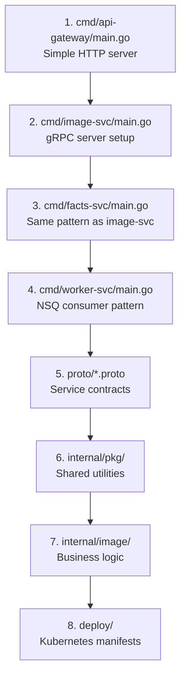

# Getting Started Guide (for Go Beginners)

*You know Python or JavaScript. You've never written Go. Let's fix that.*

---

## 1. Installing Go

### On macOS

```bash
brew install go
```

### On Linux / WSL

```bash
# Download (check https://go.dev/dl for latest)
wget https://go.dev/dl/go1.22.4.linux-amd64.tar.gz

# Install
sudo rm -rf /usr/local/go
sudo tar -C /usr/local -xzf go1.22.4.linux-amd64.tar.gz

# Add to PATH (add to ~/.bashrc or ~/.zshrc)
export PATH=$PATH:/usr/local/go/bin
export PATH=$PATH:$(go env GOPATH)/bin
```

### Verify Installation

```bash
go version
# go version go1.22.4 linux/amd64

go env GOPATH
# /home/yourname/go
```

---

## 2. Go Project Structure Explained

If you come from Python or Node.js, Go's project structure will feel different:

### Python vs Go vs Node.js

| Concept | Python | Node.js | Go |
|---------|--------|---------|-----|
| Dependency file | `requirements.txt` | `package.json` | `go.mod` |
| Lock file | `pip.lock` | `package-lock.json` | `go.sum` |
| Package registry | PyPI | npm | proxy.golang.org |
| Install deps | `pip install` | `npm install` | `go mod download` (automatic!) |
| Entry point | `main.py` | `index.js` | `main.go` (in `package main`) |
| Import system | `import module` | `require()/import` | `import "path/to/package"` |

### Voyager's Structure

```
voyager/
├── go.mod              ← "This is a Go module named github.com/gaurav/voyager"
├── go.sum              ← Lock file (auto-generated, never edit manually)
├── cmd/                ← Entry points (one per service)
│   ├── api-gateway/
│   │   └── main.go    ← "go run cmd/api-gateway/main.go" starts the gateway
│   ├── image-svc/
│   │   └── main.go
│   ├── facts-svc/
│   │   └── main.go
│   └── worker-svc/
│       └── main.go
├── internal/           ← Private code (can't be imported by other projects)
│   ├── gateway/        ← API gateway handlers
│   ├── image/          ← Image service domain logic
│   ├── facts/          ← Facts service domain logic
│   ├── worker/         ← Worker processing logic
│   ├── middleware/     ← Auth, rate limiting, logging
│   └── pkg/            ← Shared internal utilities
│       ├── config/     ← Configuration loading
│       ├── database/   ← PostgreSQL connection
│       ├── messaging/  ← NSQ producer/consumer
│       └── storage/    ← MinIO/S3 client
└── proto/              ← Protobuf definitions (.proto files)
```

**Key Go conventions**:
- `cmd/` = one directory per executable. Each must have `package main` and a `main()` function.
- `internal/` = private to this module. Other projects can't import it.
- No `src/` directory (that's a Java thing).
- Package name = directory name (mostly).

---

## 3. "Hello World" — Go vs Python

### Python

```python
# hello.py
def greet(name):
    return f"Hello, {name}!"

if __name__ == "__main__":
    message = greet("Voyager")
    print(message)
```

### Go

```go
// hello.go
package main

import "fmt"

func greet(name string) string {
    return fmt.Sprintf("Hello, %s!", name)
}

func main() {
    message := greet("Voyager")
    fmt.Println(message)
}
```

### Key Differences

| Python | Go | Why |
|--------|-----|-----|
| `def greet(name):` | `func greet(name string) string` | Go requires explicit types |
| Indentation matters | `{}` delimit blocks | Braces, not whitespace |
| `f"Hello, {name}"` | `fmt.Sprintf("Hello, %s", name)` | Printf-style formatting |
| `message = greet(...)` | `message := greet(...)` | `:=` declares AND assigns |
| Run: `python hello.py` | Run: `go run hello.go` | Similar! |
| No compilation | Compiles to binary | `go build` creates executable |

---

## 4. How to Read the Voyager Code (Where to Start)

Don't try to understand everything at once. Here's a guided path:

### Start Here (easiest → hardest)



### Reading Tips

1. **Start with `main.go`** in each service. It shows you the "skeleton" — what gets initialized, what runs.
2. **Follow the imports**. If you see `"voyager/internal/image"`, go read that package next.
3. **Look for interfaces**. They tell you WHAT a component does without the HOW.
4. **Read tests**. `*_test.go` files show you how the code is meant to be used.

---

## 5. Running the Project Step by Step

### Prerequisites

```bash
# Check you have these:
go version          # Go 1.22+
docker --version    # Docker 20+
docker compose version  # Docker Compose v2

# Install buf (protobuf tooling)
go install github.com/bufbuild/buf/cmd/buf@latest
```

### Step 1: Clone and Explore

```bash
git clone https://github.com/GauravAgarwalGarg/voyager.git
cd voyager
```

### Step 2: Start Infrastructure

```bash
# This starts PostgreSQL, NSQ, MinIO, Prometheus, Grafana, Tempo
docker compose up -d

# Verify everything is running
docker compose ps
```

### Step 3: Generate Protobuf Code

```bash
make proto
# This generates Go code from .proto files
```

### Step 4: Run the API Gateway

```bash
# Terminal 1
go run cmd/api-gateway/main.go
```

### Step 5: Test It

```bash
# Terminal 2
curl http://localhost:8080/health
# {"status":"ok","service":"api-gateway","version":"0.1.0"}
```

### Step 6: Run All Services

```bash
# Or run everything at once:
make run-all
```

### Access Points

| Service | URL | What You'll See |
|---------|-----|----------------|
| API Gateway | http://localhost:8080/health | JSON health check |
| Grafana | http://localhost:3000 | Dashboards (admin/admin) |
| Prometheus | http://localhost:9091 | Raw metrics |
| MinIO | http://localhost:9001 | File browser (minioadmin/minioadmin) |
| NSQ Admin | http://localhost:4171 | Queue status |

---

## 6. Making Your First Change (Add a New Endpoint)

Let's add a `/version` endpoint to the API Gateway. This teaches you the modify → test → verify cycle.

### Step 1: Edit the Code

Open `cmd/api-gateway/main.go` and add after the `/health` handler:

```go
    // Version endpoint (your first contribution!)
    mux.HandleFunc("/version", func(w http.ResponseWriter, r *http.Request) {
        w.Header().Set("Content-Type", "application/json")
        fmt.Fprintf(w, `{"service":"api-gateway","version":"0.1.0","go":"%s"}`, runtime.Version())
    })
```

Don't forget to add `"runtime"` to your imports:

```go
import (
    "context"
    "fmt"
    "net/http"
    "os"
    "os/signal"
    "runtime"    // Add this!
    "syscall"
    "time"

    "go.uber.org/zap"
)
```

### Step 2: Run It

```bash
go run cmd/api-gateway/main.go
```

### Step 3: Test It

```bash
curl http://localhost:8080/version
# {"service":"api-gateway","version":"0.1.0","go":"go1.22.4"}
```

You just made your first Go change! 🎉

---

## 7. Running Tests

```bash
# Run all tests
make test
# or
go test ./...

# Run tests for a specific package
go test ./internal/image/...

# Run with verbose output (see each test name)
go test -v ./internal/image/...

# Run a specific test by name
go test -v -run TestImageUpload ./internal/image/...

# Run with coverage
go test -cover ./...

# Generate HTML coverage report
go test -coverprofile=coverage.out ./...
go tool cover -html=coverage.out
```

### Writing a Test

Go tests live next to the code they test:

```
internal/image/
├── server.go          ← The code
├── server_test.go     ← Tests for that code
├── repository.go
└── repository_test.go
```

```go
// server_test.go
package image

import (
    "testing"
)

func TestGreet(t *testing.T) {
    got := greet("World")
    want := "Hello, World!"

    if got != want {
        t.Errorf("greet() = %q, want %q", got, want)
    }
}

// Table-driven tests (Go idiom)
func TestGreetTable(t *testing.T) {
    tests := []struct {
        name  string
        input string
        want  string
    }{
        {"simple", "World", "Hello, World!"},
        {"empty", "", "Hello, !"},
        {"special chars", "Go 🚀", "Hello, Go 🚀!"},
    }

    for _, tt := range tests {
        t.Run(tt.name, func(t *testing.T) {
            got := greet(tt.input)
            if got != tt.want {
                t.Errorf("greet(%q) = %q, want %q", tt.input, got, tt.want)
            }
        })
    }
}
```

---

## 8. Common Go Gotchas for Python/JS Developers

### Gotcha 1: Unused imports/variables = compile error

```go
import "fmt"  // ERROR if you don't use fmt anywhere

x := 42       // ERROR if you never use x
```

**Fix**: Remove unused things, or use `_` as a placeholder:
```go
_ = x  // "I know about x, I'll use it later"
```

### Gotcha 2: No exceptions — errors are values

```python
# Python: try/except
try:
    result = do_something()
except ValueError as e:
    handle_error(e)
```

```go
// Go: check err explicitly
result, err := doSomething()
if err != nil {
    // handle error
    return err
}
// continue with result
```

Yes, you write `if err != nil` a LOT. It's the Go way. You get used to it.

### Gotcha 3: No classes — use structs + methods

```python
# Python
class ImageService:
    def __init__(self, db):
        self.db = db
    
    def get_image(self, id):
        return self.db.query(id)
```

```go
// Go: struct + methods
type ImageService struct {
    db *Database
}

func (s *ImageService) GetImage(id string) (*Image, error) {
    return s.db.Query(id)
}
```

### Gotcha 4: Exported = Capitalized

```go
func PublicFunction() {}  // Exported (other packages can call this)
func privateFunction() {} // Unexported (only this package can call this)

type PublicStruct struct {} // Exported
type privateStruct struct {} // Unexported
```

There's no `public` / `private` keyword. Capital letter = public. Lowercase = private. Weird at first, then it's actually nice.

### Gotcha 5: No `while` loop

```go
// Go only has "for"
for i := 0; i < 10; i++ { }  // C-style for
for condition { }              // This IS the while loop
for { }                        // Infinite loop (like while True)
for _, item := range items { } // Iterate over slice/map
```

### Gotcha 6: Slices are not arrays

```go
// A slice is like Python's list (dynamic size)
names := []string{"Alice", "Bob"}
names = append(names, "Charlie")

// An array has FIXED size (rarely used)
var fixed [3]int  // exactly 3 ints, can't grow
```

### Gotcha 7: Zero values (no `None`/`null`/`undefined`)

```go
var s string   // "" (empty string, not nil!)
var n int      // 0
var b bool     // false
var p *Image   // nil (pointers CAN be nil)
```

Everything has a default zero value. No `NoneType` errors at runtime!

---

## 9. Recommended Learning Path

### Week 1: Go Basics

| Resource | Type | Time |
|----------|------|------|
| [Tour of Go](https://go.dev/tour/) | Interactive tutorial | 2-3 hours |
| [Go by Example](https://gobyexample.com/) | Code snippets | 1-2 hours |
| [Effective Go](https://go.dev/doc/effective_go) | Official guide | Read over time |

### Week 2: Go for Web/Services

| Resource | Type | Time |
|----------|------|------|
| [Let's Go](https://lets-go.alexedwards.net/) | Book (web apps) | Weekend |
| [gRPC-Go Tutorial](https://grpc.io/docs/languages/go/quickstart/) | Official docs | 2 hours |
| [Protocol Buffers Tutorial](https://protobuf.dev/getting-started/gotutorial/) | Official docs | 1 hour |

### Week 3: Go in Production

| Resource | Type | Time |
|----------|------|------|
| [Concurrency in Go](https://www.oreilly.com/library/view/concurrency-in-go/9781491941294/) | Book | Ongoing |
| [Go Database/SQL](https://go.dev/doc/database/open-handle) | Official docs | 1 hour |
| [Docker + Go](https://docs.docker.com/language/golang/) | Guide | 1 hour |

### Ongoing

| Resource | Type |
|----------|------|
| [Go Weekly Newsletter](https://golangweekly.com/) | Email |
| [/r/golang](https://reddit.com/r/golang) | Community |
| [Go Time Podcast](https://changelog.com/gotime) | Audio |

### Practice by Contributing to Voyager

Once you've done the Tour of Go, try these progressively harder tasks:

1. ✅ Add the `/version` endpoint (you already did this!)
2. Add request logging middleware (log method + path + duration)
3. Implement the `GetRandom` RPC in the facts service
4. Write a table-driven test for the image validator
5. Connect the worker to NSQ and process a test message
6. Add a Prometheus counter to track uploads

---

## Quick Reference Card

```bash
# Essential commands
go run main.go           # Run without compiling
go build -o myapp .      # Compile to binary
go test ./...            # Run all tests
go mod tidy              # Clean up go.mod/go.sum
go fmt ./...             # Format all code (do this always!)
go vet ./...             # Find common mistakes
go doc fmt.Sprintf       # Show documentation for a function

# Project commands (Makefile)
make proto               # Generate protobuf code
make build               # Build all services
make test                # Run tests
make lint                # Run linter
make run-all             # Start all services
make docker-build        # Build Docker images
```
